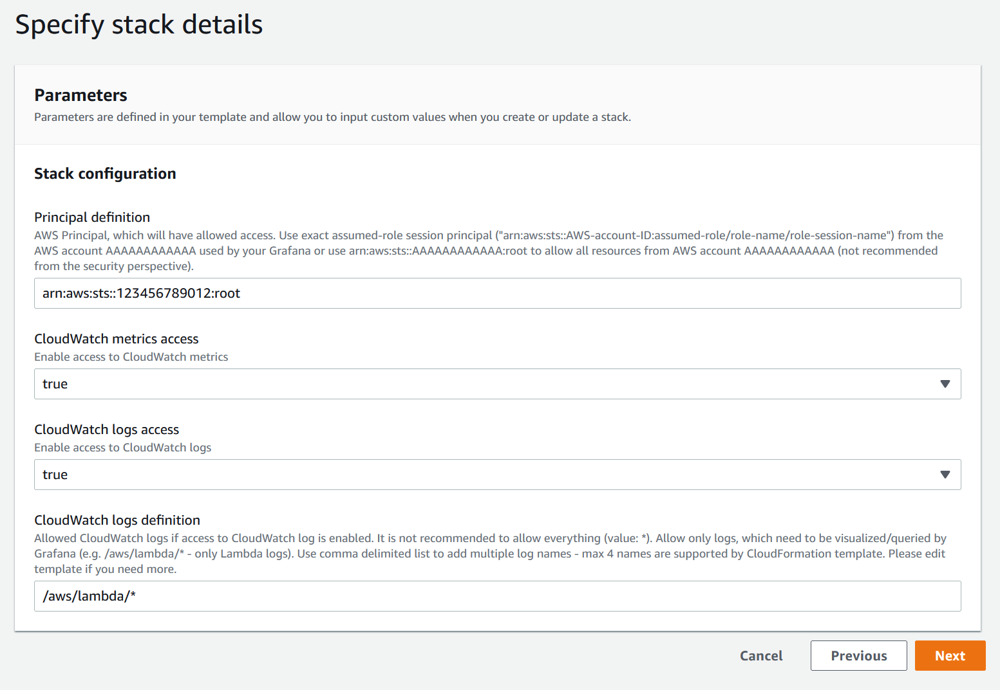
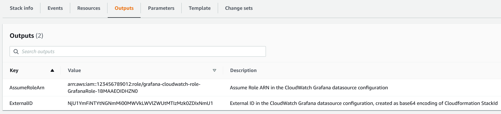
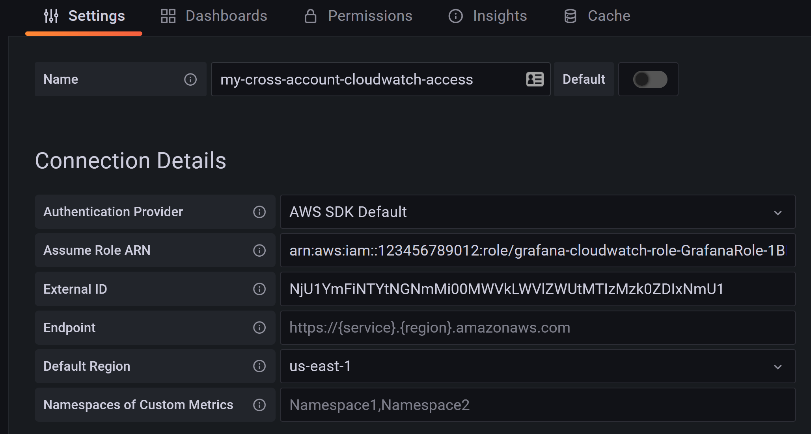

# Grafana cross account CloudWatch access

IAM role to allow Grafana read CloudWatch metrics/logs from another AWS account.

Please provision CloudFormation stack in the AWS account, where you want to 
allow access to CloudWatch metrics/logs. Customise parameters based on your 
needs:

Use stack output to configure CloudWatch datasource in your Grafana:

See https://github.com/monitoringartist/grafana-aws-cloudwatch-dashboards
for predefined AWS CloudWatch dashboards.

# Author

[Devops Monitoring Expert](http://www.jangaraj.com 'DevOps / Docker / Kubernetes / AWS ECS / Google GCP / Zabbix / Zenoss / Terraform / Monitoring'),
who loves monitoring systems and cutting/bleeding edge technologies: Docker,
Kubernetes, ECS, AWS, Google GCP, Terraform, Lambda, Zabbix, Grafana, Elasticsearch,
Kibana, Prometheus, Sysdig,...

Summary:
* 4 000+ [GitHub](https://github.com/monitoringartist/) stars
* 10 000 000+ [Grafana dashboard](https://grafana.net/monitoringartist) downloads
* 60 000 000+ [Docker images](https://hub.docker.com/u/monitoringartist/) downloads

Professional devops / monitoring / consulting services:

